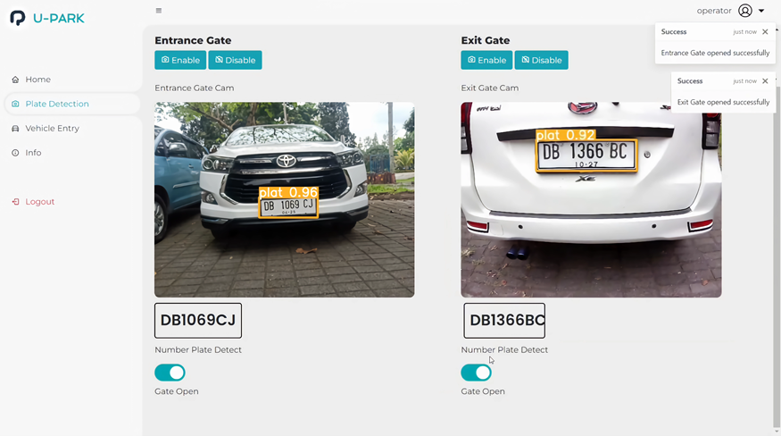

## U-Park

This code is not open source
U-Park is a parking management system that uses Number Plate Recognition (NPR) technology to manage parking at Klabat University. The U-Park application utilizes NPR technology to detect and record vehicle license plates when entering campus parking areas. With U-Park, parking managers can monitor and manage parking capacity, as well as optimize the use of parking spaces. In addition, administrators and operators can easily register vehicles, access information about the availability of parking spaces. Thus, U-Park provides an effective and efficient solution in managing the parking system on the Klabat University campus.

This web application is related to the [YOLOv5](https://github.com/JosuaLimbu/yolov5-objectdetect.git) repository which uses Number Plate Recognition with Optical Character Recognition technology.

The end result will be like this.

